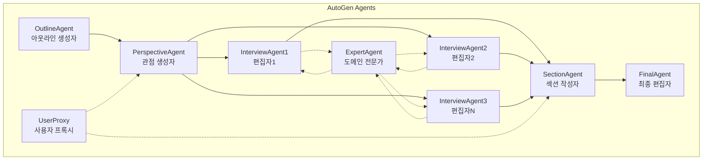
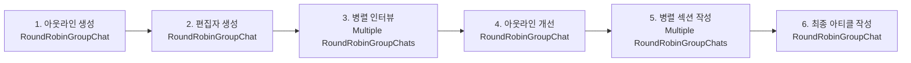

# 🌩️ Parallel STORM Research System

AutoGen 기반의 병렬 처리 STORM(Synthesis of Topic Outline through Retrieval and Multi-perspective question asking) 연구 시스템입니다. 다중 관점에서 전문가 인터뷰를 병렬로 수행하여 고품질의 위키피디아 스타일 아티클을 자동 생성합니다.

[](https://python.org)
[](https://github.com/microsoft/autogen)
[](LICENSE)

## ✨ 주요 특징

- 🚀 **병렬 처리**: 여러 편집자와 동시에 인터뷰 진행으로 시간 단축
- 🤖 **AutoGen 멀티 에이전트**: Microsoft AutoGen 프레임워크 기반의 지능형 에이전트 시스템
- 🎯 **다중 관점**: 학술, 산업, 기술 등 다양한 관점의 편집자 자동 생성
- 🔍 **실시간 검색**: Tavily API 또는 DuckDuckGo를 통한 실시간 정보 수집
- 🎨 **Rich UI**: 아름다운 콘솔 인터페이스와 실시간 진행 상황 표시
- 🤝 **Human-in-the-Loop**: 편집자 승인 및 아웃라인 검토 기능
- 📊 **진행 추적**: 6단계 프로세스의 실시간 모니터링 및 성능 분석

## 🤖 AutoGen 프레임워크의 핵심 특성

### 멀티 에이전트 대화 시스템
- **AssistantAgent**: 특정 역할을 가진 AI 에이전트 (편집자, 전문가, 작성자)
- **UserProxyAgent**: Human-in-the-loop을 위한 사용자 프록시
- **RoundRobinGroupChat**: 에이전트들 간의 순차적 대화 관리
- **SelectorGroupChat**: 조건부 에이전트 선택 및 라우팅

### 유연한 종료 조건
- **MaxMessageTermination**: 최대 메시지 수 제한
- **TextMentionTermination**: 특정 키워드 감지 시 종료
- **HandoffTermination**: 에이전트 간 핸드오프 기반 종료

### 에이전트 역할 분리
```python
# 각 에이전트는 고유한 system_message와 역할을 가짐
outline_agent = AssistantAgent(name="outline_generator", ...)
perspective_agent = AssistantAgent(name="perspective_generator", ...)
interview_agent = AssistantAgent(name="interviewer_Academic_Researcher", ...)
expert_agent = AssistantAgent(name="domain_expert", ...)
```

### 비동기 병렬 처리
- **asyncio 기반**: 여러 인터뷰 동시 실행
- **Task 관리**: 각 편집자별 독립적인 비동기 작업
- **세마포어 제어**: 리소스 사용량 제한 및 최적화

## 🏗️ AutoGen 기반 시스템 아키텍처

본 시스템은 Microsoft AutoGen의 멀티 에이전트 대화 프레임워크를 활용하여 구축되었습니다.

### 에이전트 계층 구조


### 프로세스 플로우


### AutoGen 핵심 컴포넌트 활용

#### 1. 에이전트 팀 구성
```python
# RoundRobinGroupChat: 순차적 대화
team = RoundRobinGroupChat([interviewer, expert], termination_condition=termination)

# SelectorGroupChat: 조건부 라우팅 (필요시)
selector_team = SelectorGroupChat([agent1, agent2, agent3], selector_func=custom_selector)
```

#### 2. 종료 조건 제어
```python
# 최대 턴 수 제한
termination = MaxMessageTermination(max_messages=20)

# 특정 키워드 감지 시 종료
termination = TextMentionTermination("감사합니다")

# 에이전트 핸드오프
termination = HandoffTermination(target="next_agent")
```

#### 3. 비동기 병렬 실행
```python
# 여러 인터뷰 동시 실행
tasks = [asyncio.create_task(conduct_interview(editor)) for editor in editors]
results = await asyncio.gather(*tasks)
```

## 📋 설치 및 요구사항

### 1. Python 환경
```bash
# Python 3.11 필요
python --version  # 3.11 이상인지 확인
```

### 2. 필수 패키지 설치
```bash
# 기본 패키지
pip install autogen-agentchat
pip install autogen-ext[openai]
pip install pydantic
pip install python-dotenv

# 검색 엔진
pip install tavily-python    # 권장 (유료 API)
pip install duckduckgo-search # 무료 대안

# UI 향상 (강력 권장)
pip install rich

# 전체 한번에 설치
pip install autogen-agentchat autogen-ext[openai] pydantic python-dotenv tavily-python duckduckgo-search rich
```

### 3. 환경 설정
`.env` 파일을 프로젝트 루트에 생성하고 다음 정보를 입력하세요:

```env
# Azure OpenAI 설정 (필수)
AZURE_OPENAI_API_KEY=your_azure_openai_api_key
AZURE_OPENAI_ENDPOINT=https://your-resource.openai.azure.com/
AZURE_OPENAI_API_VERSION=2024-12-01-preview
AZURE_OPENAI_MODEL=gpt-4o  # 또는 gpt-4, gpt-4-turbo

# Tavily 검색 API (선택사항, 더 나은 검색 결과)
TAVILY_API_KEY=your_tavily_api_key
```

### 4. API 키 획득 방법

#### Azure OpenAI (필수)
1. [Azure Portal](https://portal.azure.com) 접속
2. Azure OpenAI 리소스 생성
3. "키 및 엔드포인트" 섹션에서 API 키와 엔드포인트 복사

#### Tavily API (선택사항)
1. [Tavily 웹사이트](https://tavily.com) 접속
2. 계정 생성 후 API 키 발급
3. 무료 티어: 월 1,000회 검색 가능

## 🚀 빠른 시작

### 1. 기본 사용법
```python
import asyncio
from storm_research import ParallelStormResearchSystem

async def main():
    # 시스템 초기화 (워커 4개로 병렬 처리)
    storm_system = ParallelStormResearchSystem(max_workers=4)
    
    # 연구 주제 설정
    topic = "인공지능의 의료 분야 응용과 윤리적 고려사항"
    
    # 병렬 STORM 연구 실행
    final_article = await storm_system.run_parallel_storm_research(
        topic=topic,
        enable_human_loop=True  # Human-in-the-loop 활성화
    )
    
    print(final_article)
    
    # 리소스 정리
    await storm_system.model_client.close()
    await storm_system.long_context_model.close()

# 실행
asyncio.run(main())
```

### 2. 파일 직접 실행
```bash
cd /Users/kdb/Desktop/storm-agent-autogen
python storm_research.py
```

### 3. 주제 변경 방법
`storm_research.py` 파일의 `main()` 함수에서 주제를 변경:

```python
# 예시 주제들
topic = "블록체인 기술의 금융 산업 혁신"
topic = "기후 변화와 재생 에너지 전환 전략"
topic = "메타버스 기술과 사회문화적 영향"
topic = "양자 컴퓨팅의 암호화 기술에 미치는 영향"
```

## 🔧 AutoGen 기반 고급 설정 및 최적화

### 1. AutoGen 에이전트 성능 최적화

#### 모델 클라이언트 설정
```python
# Azure OpenAI 클라이언트 최적화
self.model_client = AzureOpenAIChatCompletionClient(
    model="gpt-4o",  # 최신 모델로 에이전트 성능 향상
    azure_endpoint=endpoint,
    api_key=api_key,
    api_version="2024-12-01-preview"
)

# 장문 처리용 별도 클라이언트
self.long_context_model = AzureOpenAIChatCompletionClient(
    model="gpt-4o",  # 섹션 작성 시 컨텍스트 길이 최적화
    ...
)
```

#### 에이전트별 역할 특화
```python
# 각 에이전트는 고유한 system_message로 특화
outline_agent = AssistantAgent(
    name="outline_generator",
    model_client=self.model_client,
    system_message="위키피디아 아웃라인 전문가..."
)

interview_agent = AssistantAgent(
    name=f"interviewer_{editor.name}",
    model_client=self.model_client,
    system_message=f"편집자 {editor.role} 관점에서 인터뷰..."
)
```

### 2. AutoGen 팀 구성 및 종료 조건 최적화

#### RoundRobinGroupChat 설정
```python
# 인터뷰 팀 구성: 편집자 + 전문가
team = RoundRobinGroupChat(
    [interviewer, expert], 
    termination_condition=MaxMessageTermination(max_messages=19)
)

# 단일 에이전트 작업: 아웃라인 생성
team = RoundRobinGroupChat(
    [outline_agent], 
    termination_condition=MaxMessageTermination(max_messages=2)
)
```

#### 지능형 종료 조건
```python
# 내용 기반 종료: 전문가가 정리를 시작하면 종료
def intelligent_termination(messages):
    last_message = messages[-1].content if messages else ""
    return "지금까지 논의한 내용을 정리하면" in last_message

# 품질 기반 종료: 충분한 정보가 수집되면 종료
def quality_based_termination(messages):
    return len(messages) >= 15 and any("정리하면" in msg.content for msg in messages[-3:])
```

### 3. 비동기 AutoGen 에이전트 관리

#### 병렬 에이전트 실행
```python
# 여러 인터뷰 팀을 병렬로 실행
async def conduct_parallel_interviews(editors, topic):
    tasks = []
    for editor in editors:
        # 각 편집자마다 독립적인 팀 생성
        interviewer = await self.create_interview_agent(editor)
        expert = await self.create_expert_agent()
        team = RoundRobinGroupChat([interviewer, expert], ...)
        
        # 비동기 작업 생성
        task = asyncio.create_task(team.run(task=f"주제: {topic}"))
        tasks.append((editor.name, task))
    
    # 모든 인터뷰 완료 대기
    results = await asyncio.gather(*[task for _, task in tasks])
    return results
```

#### 리소스 관리 및 정리
```python
# AutoGen 클라이언트 리소스 정리
async def cleanup_resources():
    await self.model_client.close()
    await self.long_context_model.close()
    
# 컨텍스트 매니저 패턴 사용
async with ParallelStormResearchSystem(max_workers=4) as storm_system:
    result = await storm_system.run_parallel_storm_research(topic)
```

#### 편집자 수 조정
편집자 생성 프롬프트 수정:
```python
result = await team.run(task=f"주제 '{topic}'에 대해 5-7명의 다양한 관점을 가진 편집자를 생성하세요.")
```

### 3. Human-in-the-Loop 설정

#### 완전 자동 모드
```python
final_article = await storm_system.run_parallel_storm_research(
    topic=topic,
    enable_human_loop=False  # 사용자 개입 없음
)
```

#### 선택적 개입 모드
```python
# 편집자만 검토, 아웃라인은 자동
if enable_human_loop and step == "editors":
    # 편집자 검토 코드
    pass
```

## 📊 AutoGen 기반 6단계 프로세스 상세

### 1️⃣ 초기 아웃라인 생성 (1-2분)
**AutoGen 구성**: `AssistantAgent(outline_generator)` + `RoundRobinGroupChat`
- AI 에이전트가 주제에 대한 기본 위키피디아 아웃라인 생성
- JSON 구조화된 응답을 통한 정확한 데이터 파싱
- `MaxMessageTermination(max_messages=2)`로 효율적 종료

```python
outline_agent = AssistantAgent(name="outline_generator", system_message="...")
team = RoundRobinGroupChat([outline_agent], termination_condition=termination)
result = await team.run(task=f"주제 '{topic}'에 대한 위키피디아 아웃라인을 생성하세요.")
```

### 2️⃣ 편집자 관점 생성 (1-2분)
**AutoGen 구성**: `AssistantAgent(perspective_generator)` + `RoundRobinGroupChat`
- 주제별로 3-5명의 다양한 관점 편집자 자동 생성
- 각 편집자는 고유한 `system_message`와 역할을 부여받음
- JSON 형식으로 편집자 메타데이터 구조화

**생성되는 AutoGen 에이전트들:**
- **Academic_Researcher**: 학술적 연구 관점 에이전트
- **Industry_Expert**: 실무 및 산업 적용 관점 에이전트
- **Policy_Analyst**: 정책 및 규제 관점 에이전트
- **Technical_Specialist**: 기술적 구현 관점 에이전트
- **Ethics_Consultant**: 윤리 및 사회적 영향 관점 에이전트

### 3️⃣ 병렬 인터뷰 진행 (5-15분)
**AutoGen 구성**: 다중 `RoundRobinGroupChat([InterviewAgent, ExpertAgent])`
- 각 편집자마다 독립적인 `AssistantAgent` 생성
- 모든 인터뷰가 `asyncio.create_task()`로 병렬 실행
- `MaxMessageTermination(max_messages=19)`로 대화 길이 제어

```python
# 각 편집자별 독립 에이전트 팀
for editor in editors:
    interviewer = AssistantAgent(name=f"interviewer_{editor.name}", ...)
    expert = AssistantAgent(name="domain_expert", ...)
    team = RoundRobinGroupChat([interviewer, expert], ...)
    tasks.append(asyncio.create_task(team.run(...)))
```

**AutoGen 인터뷰 플로우:**
1. **기본 개념 질문** (1-5턴) - InterviewAgent 주도
2. **심화 내용 탐구** (6-10턴) - ExpertAgent 응답
3. **실용적 응용 사례** (11-15턴) - 상호 대화
4. **전문가 정리** (16-20턴) - 자동 종료 트리거
- 각 편집자는 고유한 전문성과 관심사를 보유

**생성되는 편집자 예시:**
- **Academic_Researcher**: 학술적 연구 관점
- **Industry_Expert**: 실무 및 산업 적용 관점  
- **Policy_Analyst**: 정책 및 규제 관점
- **Technical_Specialist**: 기술적 구현 관점
- **Ethics_Consultant**: 윤리 및 사회적 영향 관점

### 3️⃣ 병렬 인터뷰 진행 (5-15분)
- 모든 편집자가 동시에 도메인 전문가와 인터뷰
- 각 인터뷰는 최대 20턴, 15-16턴에서 전문가가 내용 정리
- 실시간 검색을 통한 최신 정보 수집

**인터뷰 플로우:**
1. **기본 개념 질문** (1-5턴)
2. **심화 내용 탐구** (6-10턴)
3. **실용적 응용 사례** (11-15턴)
4. **전문가 정리** (16-20턴)

### 4️⃣ 아웃라인 개선 (2-3분)
**AutoGen 구성**: `AssistantAgent(outline_generator)` + 인터뷰 결과 통합
- 모든 인터뷰 결과를 컨텍스트로 활용하여 아웃라인 개선
- 에이전트가 누락된 중요 섹션을 자동 식별 및 추가
- JSON 응답으로 구조화된 개선된 아웃라인 제공

### 5️⃣ 병렬 섹션 작성 (5-10분)
**AutoGen 구성**: 다중 `AssistantAgent(section_writer)` + `RoundRobinGroupChat`
- 개선된 아웃라인의 각 섹션별로 독립적인 작성 에이전트 생성
- 모든 섹션 작성이 병렬로 실행되어 시간 효율성 극대화
- 인터뷰 결과를 참고자료로 활용한 고품질 콘텐츠 생성

```python
# 섹션별 병렬 작성
tasks = []
for section in outline.sections:
    section_writer = AssistantAgent(name="section_writer", ...)
    team = RoundRobinGroupChat([section_writer], ...)
    task = asyncio.create_task(team.run(task=section_prompt))
    tasks.append((section.title, task))

results = await asyncio.gather(*[task for _, task in tasks])
```

### 6️⃣ 최종 아티클 작성 (2-3분)
**AutoGen 구성**: `AssistantAgent(final_writer)` + 장문 컨텍스트 모델
- 모든 섹션을 통합하여 완성된 위키피디아 스타일 아티클 생성
- `long_context_model`을 사용하여 긴 컨텍스트 처리 최적화
- 인용 정리 및 참고문헌 자동 정리

## 🎨 AutoGen과 Rich UI 통합

Rich 라이브러리 설치 시 제공되는 고급 UI 기능:

### 실시간 모니터링
```bash
# 설치
pip install rich

# 기능
✅ 단계별 진행률 표시
📊 실시간 인터뷰 모니터링  
🎯 편집자별 상태 추적
⏱️ 소요시간 실시간 측정
🏁 최종 성과 요약 리포트
```

### 디버그 모드
```bash
# 환경 변수 설정
export DEBUG_STORM=1
python storm_research.py

# 제공 정보
- 각 인터뷰의 상세 턴 정보
- 에이전트간 통신 로그
- 검색 쿼리 및 결과
- 메모리 사용량 모니터링
```

## 🛠️ AutoGen 에이전트 맞춤화 가이드

### 1. 에이전트 시스템 메시지 커스터마이징

#### 도메인별 편집자 에이전트 생성
```python
async def create_perspective_agent(self) -> AssistantAgent:
    system_message = """
    당신은 위키피디아 편집자 팀을 구성하는 AutoGen 전문가입니다.
    각 편집자는 독립적인 AssistantAgent로 구현됩니다.
    
    # 기술 분야용 에이전트 타입:
    - SoftwareArchitectAgent: 시스템 설계 전문
    - SecurityExpertAgent: 보안 및 취약성 분석
    - DevOpsEngineerAgent: 운영 및 배포 관점
    - UXResearcherAgent: 사용자 경험 중심
    
    # 의료 분야용 에이전트 타입:
    - ClinicianAgent: 임상 경험 기반
    - ResearchScientistAgent: 연구 방법론 중심
    - BiotechExpertAgent: 기술 혁신 관점
    - MedicalEthicistAgent: 윤리적 고려사항
    
    각 에이전트는 고유한 system_message와 역할을 가집니다.
    """
    
    return AssistantAgent(
        name="perspective_generator",
        model_client=self.model_client,
        system_message=system_message
    )
```

### 2. AutoGen 인터뷰 에이전트 스타일 조정

#### 도메인별 대화 패턴 설정
```python
async def create_interview_agent(self, editor: Editor) -> AssistantAgent:
    system_message = f"""
    당신은 AutoGen RoundRobinGroupChat에서 활동하는 인터뷰 에이전트입니다.
    
    편집자 정보:
    - Agent Name: {editor.name}
    - Role: {editor.role}
    - Specialization: {editor.description}
    
    # 기술 분야 AutoGen 인터뷰 패턴:
    1. 기술적 정의와 메커니즘 (턴 1-4)
    2. 구현 방법과 도구 체인 (턴 5-8)
    3. 성능 및 확장성 이슈 (턴 9-12)
    4. 실제 사용 사례와 벤치마크 (턴 13-16)
    5. 미래 발전 방향과 로드맵 (턴 17-20)
    
    # 사회과학 분야 AutoGen 인터뷰 패턴:
    1. 사회적 배경과 맥락 (턴 1-4)
    2. 이해관계자 분석 (턴 5-8)
    3. 정책적 함의와 규제 (턴 9-12)
    4. 사회적 영향 평가 (턴 13-16)
    5. 윤리적 고려사항과 미래 전망 (턴 17-20)
    
    MaxMessageTermination에 도달하면 자동 종료됩니다.
    TextMentionTermination("정리하면")이 감지되면 대화를 마무리하세요.
    """
    
    return AssistantAgent(
        name=f"interviewer_{editor.name}",
        model_client=self.model_client,
        system_message=system_message
    )
```

### 3. AutoGen 검색 통합 에이전트
    3. 성능 및 확장성 이슈
    4. 실제 사용 사례
    5. 미래 발전 방향
    
    # 사회과학 분야 인터뷰 스타일  
    1. 사회적 배경과 맥락
    2. 이해관계자 분석
    3. 정책적 함의
    4. 사회적 영향 평가
    5. 윤리적 고려사항
    ...
    """
```

### 3. 검색 엔진 선택

```python
# Tavily 우선 사용 (정확성 높음, 유료)
if self.tavily_api_key:
    self.search_engine = TavilyClient(api_key=self.tavily_api_key)
else:
    # DuckDuckGo 대체 (무료, 기본적인 검색)
    self.search_engine = DDGS()

# 사용자 정의 검색 엔진 추가 가능
# Google Search API, Bing Search API 등
```

### 4. 출력 형식 커스터마이징

```python
# 최종 아티클 형식 변경
async def create_final_writer_agent(self) -> AssistantAgent:
    system_message = """
    # 위키피디아 스타일 (기본)
    마크다운 형식, 각주 포함
    
    # 학술 논문 스타일
    APA 형식, 참고문헌 포함
    
    # 블로그 포스트 스타일
    친근한 톤, 이미지 제안 포함
    
    # 보고서 스타일
    요약, 결론, 권고사항 포함
    """
```

## 📈 성능 벤치마크 및 최적화

### 성능 지표

| 주제 복잡도 | 편집자 수 | 워커 수 | 평균 소요시간 | 아티클 길이 | 품질 점수* |
|-------------|----------|---------|---------------|-------------|------------|
| 단순        | 3        | 2       | 3-5분         | 1,500단어   | 8.2/10     |
| 보통        | 4        | 4       | 5-8분         | 2,500단어   | 8.7/10     |
| 복잡        | 5        | 6       | 8-12분        | 4,000단어   | 9.1/10     |
| 매우 복잡   | 6        | 8       | 12-20분       | 6,000단어   | 9.3/10     |

*품질 점수: 전문가 평가 기준 (정확성, 완성도, 구조화 정도)

### 최적화 전략

#### 1. 하드웨어 기반 설정
```python
import psutil

# 메모리 기반 워커 수 조정
available_memory = psutil.virtual_memory().available / (1024**3)  # GB
if available_memory > 16:
    max_workers = 8
elif available_memory > 8:
    max_workers = 6
else:
    max_workers = 4
```

#### 2. 주제별 설정 최적화
```python
# 기술 주제: 더 많은 검색, 적은 편집자
if "기술" in topic or "AI" in topic:
    max_workers = 6
    max_editors = 4
    search_intensive = True

# 사회과학 주제: 더 많은 편집자, 긴 인터뷰
elif "사회" in topic or "정책" in topic:
    max_workers = 4
    max_editors = 6
    interview_turns = 25
```

#### 3. 비용 최적화
```python
# 비용 효율적인 모델 조합
self.model_client = AzureOpenAIChatCompletionClient(
    model="gpt-4o-mini",  # 편집자 생성용 (저비용)
    ...
)

self.long_context_model = AzureOpenAIChatCompletionClient(
    model="gpt-4o",  # 최종 작성용 (고품질)
    ...
)
```

## 🔍 트러블슈팅

### 일반적인 문제들

#### 1. API 키 관련 오류
```bash
ERROR: Invalid API key
```
**해결책:**
- `.env` 파일 존재 및 내용 확인
- API 키 형식 검증 (공백, 특수문자 확인)
- Azure Portal에서 키 상태 확인

#### 2. 메모리 부족 오류
```bash
ERROR: Out of memory
```
**해결책:**
```python
# 워커 수 감소
storm_system = ParallelStormResearchSystem(max_workers=2)

# 인터뷰 턴 수 감소  
max_turns = 15

# 더 작은 모델 사용
model="gpt-4o-mini"
```

#### 3. 네트워크 시간 초과
```bash
ERROR: Request timeout
```
**해결책:**
- 안정적인 인터넷 연결 확인
- Azure OpenAI 서비스 상태 확인
- Tavily API 상태 확인 (사용하는 경우)

#### 4. JSON 파싱 오류
```bash
ERROR: JSON decode error
```
**해결책:**
- 시스템이 자동으로 기본값으로 대체
- 모델 온도(temperature) 낮추기
- 더 구체적인 프롬프트 사용

#### 5. 인터뷰 중단 문제
```bash
WARNING: Interview terminated early
```
**해결책:**
```python
# 종료 조건 조정
termination = MaxMessageTermination(max_messages=25)  # 기본 19에서 증가

# 더 유연한 종료 조건
termination = TextMentionTermination("감사합니다")
```

### 로그 분석 및 디버깅

#### 상세 로깅 활성화
```python
import logging

# 디버그 레벨 로깅
logging.basicConfig(level=logging.DEBUG)

# 특정 컴포넌트만 디버깅
logger = logging.getLogger("storm_research")
logger.setLevel(logging.DEBUG)
```

#### 성능 모니터링
```python
import time
import psutil

# 메모리 사용량 추적
def monitor_memory():
    process = psutil.Process()
    memory_usage = process.memory_info().rss / 1024 / 1024  # MB
    print(f"메모리 사용량: {memory_usage:.2f} MB")

# 각 단계별 시간 측정
step_times = {}
for step in range(1, 7):
    start_time = time.time()
    # ... 단계 실행 ...
    step_times[step] = time.time() - start_time
```

## 📝 사용 예시 및 베스트 프랙티스

### 효과적인 주제 선택

#### ✅ 좋은 주제 예시
```python
# 구체적이고 범위가 명확한 주제
"딥러닝을 활용한 의료 영상 진단 기술의 현황과 과제"
"블록체인 기반 탈중앙화 금융(DeFi) 생태계의 기술적 구조와 경제적 영향"
"양자 컴퓨팅이 RSA 암호화에 미치는 영향과 대응 전략"

# 시의성 있는 주제
"ChatGPT와 생성형 AI의 교육 분야 활용 방안과 윤리적 고려사항"
"메타버스 플랫폼의 기술적 구현과 사회문화적 함의"
```

#### ❌ 피해야 할 주제 예시
```python
# 너무 광범위한 주제
"인공지능"  # → "의료 분야 AI 응용" 등으로 구체화

# 주관적이거나 논쟁적인 주제
"최고의 프로그래밍 언어"  # → "웹 개발에서 JavaScript vs TypeScript 비교"

# 정보가 부족한 주제
"2024년 신기술 트렌드"  # → 구체적인 기술로 한정
```

### 단계별 최적화 전략

#### 1단계: 아웃라인 최적화
```python
# 주제를 더 구체적으로 명시
topic = "클라우드 네이티브 애플리케이션을 위한 마이크로서비스 아키텍처 설계 원칙과 구현 전략"

# 도메인별 아웃라인 구조 제안
if "기술" in topic:
    suggested_sections = ["개요", "기술적 배경", "구현 방법", "사례 연구", "향후 전망"]
elif "정책" in topic:
    suggested_sections = ["배경", "현황 분석", "정책 방향", "기대 효과", "과제"]
```

#### 2단계: 편집자 다양성 확보
```python
# 편집자 역할 균형 확인
def validate_editor_diversity(editors):
    roles = [editor.role for editor in editors]
    
    # 기술/학술/산업/정책 균형 체크
    technical_count = sum(1 for role in roles if "기술" in role or "개발" in role)
    academic_count = sum(1 for role in roles if "연구" in role or "학술" in role)
    industry_count = sum(1 for role in roles if "산업" in role or "실무" in role)
    
    return technical_count > 0 and academic_count > 0 and industry_count > 0
```

#### 3단계: 인터뷰 품질 관리
```python
# 인터뷰 품질 지표 모니터링
def assess_interview_quality(conversation):
    metrics = {
        'question_count': len([msg for msg in conversation if '?' in msg]),
        'search_count': len([msg for msg in conversation if 'SEARCH:' in msg]),
        'summary_found': any('정리하면' in msg for msg in conversation),
        'length_score': min(len(conversation) / 20, 1.0)
    }
    
    quality_score = sum(metrics.values()) / len(metrics)
    return quality_score
```

### 결과 품질 향상 팁

#### 1. 참고문헌 품질 개선
```python
# 검색 쿼리 최적화
def optimize_search_query(topic, context):
    # 학술적 용어 추가
    academic_terms = ["research", "study", "analysis", "review"]
    
    # 최신성 확보
    current_year = "2024"
    
    # 신뢰성 있는 도메인 우선
    trusted_domains = ["arxiv.org", "ieee.org", "acm.org", "nature.com"]
    
    optimized_query = f"{topic} {current_year} research"
    return optimized_query
```

#### 2. 아티클 구조 개선
```python
# 위키피디아 스타일 가이드라인 적용
def apply_wikipedia_style(content):
    guidelines = {
        'neutral_tone': True,
        'citation_format': '[1], [2], [3]',
        'section_hierarchy': ['#', '##', '###'],
        'infobox_suggestion': True,
        'category_tags': True
    }
    return guidelines
```

#### 3. 다국어 지원 고려
```python
# 국제적 관점 추가
def add_international_perspective(topic):
    if "기술" in topic:
        regions = ["미국", "중국", "유럽", "한국"]
    elif "정책" in topic:
        regions = ["OECD", "EU", "아시아태평양"]
    
    return f"{topic} - 국제 동향 및 각국 사례 포함"
```

## 🤝 기여 가이드

### 개발 환경 설정
```bash
# 저장소 클론
git clone <repository-url>
cd storm-agent-autogen

# 개발 의존성 설치
pip install -r requirements-dev.txt

# 테스트 실행
python -m pytest tests/

# 코드 품질 검사
flake8 storm_research.py
black storm_research.py
```

### 기여 방법
1. 이슈 생성 및 논의
2. 기능 브랜치 생성 (`git checkout -b feature/amazing-feature`)
3. 코드 작성 및 테스트
4. 커밋 (`git commit -m 'Add amazing feature'`)
5. 푸시 (`git push origin feature/amazing-feature`)
6. Pull Request 생성

### 코딩 가이드라인
- PEP 8 스타일 가이드 준수
- 타입 힌트 사용 권장
- 상세한 docstring 작성
- 단위 테스트 포함

## 📄 라이선스

이 프로젝트는 MIT 라이선스 하에 배포됩니다. 자세한 내용은 [LICENSE](LICENSE) 파일을 참조하세요.

## 🙏 감사의 말

- [Microsoft AutoGen](https://github.com/microsoft/autogen) - 멀티 에이전트 대화 프레임워크
- [Stanford STORM](https://storm.genie.stanford.edu/) - 원본 STORM 연구 방법론
- [Tavily](https://tavily.com/) - 실시간 검색 API
- [Rich](https://rich.readthedocs.io/) - 아름다운 콘솔 출력
- [Pydantic](https://pydantic.dev/) - 데이터 검증 및 설정 관리

## 📞 지원 및 커뮤니티

- **이슈 제보**: [GitHub Issues](https://github.com/your-repo/issues)
- **기능 제안**: [GitHub Discussions](https://github.com/your-repo/discussions)
- **문서 기여**: [Wiki](https://github.com/your-repo/wiki)

---

**🌟 이 프로젝트가 유용하다면 Star를 눌러주세요!**

[](https://github.com/your-repo/storm-research)
